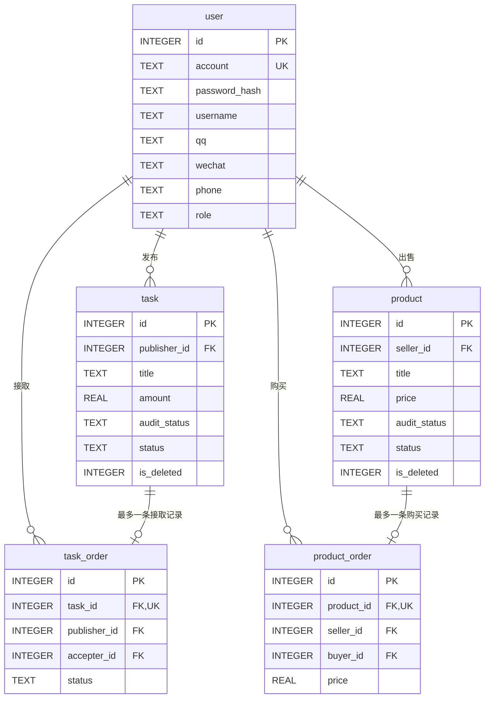

# 校园跑腿交易平台 —— 数据库设计说明书

| 项目 | 内容 |
|---|---|
| 数据库 | SQLite 3（Python 标准库 `sqlite3`，无需安装数据库服务） |
| 数据库文件 | `backend/db/app.db`，由 `init_db.py` 生成 |
| 版本 | v1.1，对应《校园跑腿交易平台需求分析》v1.2 普通用户端第一阶段 |
| 表数量 | 5 张表 + 2 个视图 |
| 当前范围 | 仅支持普通用户端；管理员字段保留，管理员功能延期 |
| 对应接口契约 | 《接口契约》v1.0 |

**这份文档的用途**：前端和后端各自写接口文档时，字段名、枚举取值、时间格式一律以本文档为准。任何一方想加字段或改枚举，先改这里，再通知另一方。

---

## 一、快速开始

```bash
cd backend/db
python init_db.py     # 建库 + 预置账号 + 造演示数据（可反复执行，会清空重建）
python test_db.py     # 验证约束和查询，25 项检查
```

**预置账号**（`init_db.py` 自动创建）：

| 账号 | 密码 | 角色 | 用途 |
|---|---|---|---|
| `admin` | `admin123` | 管理员（兼容预置） | 当前版本不验收，供后续管理员模块使用 |
| `alice` | `alice123` | 普通用户 | 演示发布方 |
| `bob` | `bob123` | 普通用户 | 演示接取方/购买方 |
| `carol` | `carol123` | 普通用户 | 备用普通用户 |

演示数据已覆盖数据库预留状态：待审核、已通过、已驳回、已接取、已完成、已删除、已售出；其中审核和删除状态不在当前普通用户接口中操作。**前端不用等后端接口，直接读这个库就能调页面。**

---

## 二、表关系（ER）



`task ||--o| task_order` 是 **一对零或一**：一个任务要么没人接，要么被且只被一个人接走。这个"只有一个"是靠 `task_order.task_id` 上的 `UNIQUE` 约束保证的，不是靠后端代码自觉。

---

## 三、核心设计：为什么有两个状态字段

历史需求文档 §4.2 说任务状态是「待审核 → 已发布」，§6 又说是「待接取-已接取-进行中-已送达-完成」，两处对不上。原因是它们描述的是**两个互相独立的维度**。本阶段管理员功能延期，但为了兼容既有数据库和后续扩展，两个字段继续保留：

| 维度 | 字段 | 回答的问题 | 谁能改 |
|---|---|---|---|
| 审核 | `audit_status` | 这条内容能不能被普通用户看见 | 后续管理员模块；当前 API 创建时固定为 `approved` |
| 业务 | `status` | 这一单交易走到哪一步了 | 发布者 / 接取方 |

所以历史审核流程中的新任务是 `audit_status='pending'` + `status='open'`。当前版本没有审核接口，普通用户通过接口创建任务时必须显式写入 `audit_status='approved'` + `status='open'`，保证发布后可以出现在公开列表；`pending/rejected` 仅作为演示数据和后续管理员模块的兼容状态。未来管理员点通过时只改 `audit_status`，任务即可出现在列表并被接取。

**塞进一个字段会怎样**：假设只有一个 `status`，那么"已接取的任务被管理员驳回"这种情况就没法表达——你得在"已接取"和"已驳回"里二选一，丢掉另一个信息。拆成两个字段就没这个问题。

删除同理，用独立的 `is_deleted` 而不是 `status='deleted'`：后续管理员删除一条**已完成**的任务后，`status` 仍然是 `completed`，历史记录不会被破坏；当前版本不提供软删除接口。

---

## 四、表结构逐字段说明

### 4.1 `user` 用户表

| 字段 | 类型 | 约束 | 说明 |
|---|---|---|---|
| `id` | INTEGER | PK, 自增 | 主键 |
| `account` | TEXT | NOT NULL, **UNIQUE** | 登录账号，不可重复（P0-01） |
| `password_hash` | TEXT | NOT NULL | **只存哈希，禁止明文**（P0-05） |
| `username` | TEXT | NOT NULL | 昵称，用户可自行修改 |
| `qq` / `wechat` / `phone` | TEXT | 可空 | 允许为空、不做格式和真实性校验（需求明确要求） |
| `role` | TEXT | CHECK, 默认 `user` | `user` / `admin`；当前接口只验收 `user` |
| `status` | TEXT | CHECK, 默认 `active` | `active` / `banned`，第一周不用，预留封禁 |
| `created_at` / `updated_at` | TEXT | NOT NULL | 见下方时间格式约定 |

> `admin` 账号由 `init_db.py` 兼容预置，但管理员登录和管理接口延期。注册接口**必须**写死 `role='user'`，不能接受前端传入的 role，否则任何人都能注册成管理员。

### 4.2 `task` 跑腿任务表

| 字段 | 类型 | 约束 | 说明 |
|---|---|---|---|
| `id` | INTEGER | PK, 自增 | |
| `publisher_id` | INTEGER | NOT NULL, FK→user | 发布者 |
| `title` | TEXT | NOT NULL | **关键词检索字段之一** |
| `description` | TEXT | 默认 `''` | 任务说明，**关键词检索字段之一** |
| `pickup` | TEXT | NOT NULL | 取件地点 |
| `delivery` | TEXT | NOT NULL | 送达地点 |
| `deadline` | TEXT | 可空 | 截止时间 |
| `amount` | REAL | **CHECK ≥ 0** | 跑腿费（元），**排序字段**，仅记录不支付 |
| `contact` | TEXT | 默认 `''` | 联系方式/备注，纯文本 |
| `audit_status` | TEXT | CHECK, 默认 `pending` | `pending`/`approved`/`rejected`；当前 API 创建时显式写 `approved` |
| `audit_remark` | TEXT | 可空 | 后续审核模块的驳回理由，当前接口不写入 |
| `status` | TEXT | CHECK, 默认 `open` | `open`/`accepted`/`delivered`/`completed`（+1 个预留） |
| `is_deleted` | INTEGER | CHECK ∈ (0,1) | 后续软删除标记；当前接口固定为 `0` |
| `deleted_by` | INTEGER | FK→user | 后续删除操作的执行人 |
| `deleted_at` | TEXT | 可空 | 后续删除时间 |
| `created_at` | TEXT | NOT NULL | **排序字段** |
| `updated_at` | TEXT | NOT NULL | 每次 UPDATE 记得一起更新 |

### 4.3 `product` 二手商品表

结构与 `task` 平行，差异字段：

| 字段 | 类型 | 约束 | 说明 |
|---|---|---|---|
| `seller_id` | INTEGER | NOT NULL, FK→user | 卖家 |
| `category` | TEXT | CHECK, 默认 `other` | 分类，前端下拉框取值见枚举字典 |
| `condition` | TEXT | CHECK, 默认 `good` | 成色 |
| `price` | REAL | **CHECK ≥ 0** | 价格（元），**排序字段** |
| `location` | TEXT | 默认 `''` | 交易地点 |
| `status` | TEXT | CHECK, 默认 `on_sale` | `on_sale`/`sold`（+1 个预留） |

商品表同样保留 `audit_status`、`audit_remark`、`is_deleted`、`deleted_by`、`deleted_at`；当前普通用户发布时显式写入 `audit_status='approved'`、`is_deleted=0`，这些字段不由普通用户接口修改。

### 4.4 `task_order` 跑腿记录表

| 字段 | 类型 | 约束 | 说明 |
|---|---|---|---|
| `id` | INTEGER | PK, 自增 | |
| `task_id` | INTEGER | NOT NULL, **UNIQUE**, FK→task | UNIQUE 保证一个任务只被接一次 |
| `publisher_id` | INTEGER | NOT NULL, FK→user | 冗余存一份，个人空间查询免 JOIN |
| `accepter_id` | INTEGER | NOT NULL, FK→user | 接取方 |
| `status` | TEXT | CHECK, 默认 `accepted` | `accepted`/`delivered`/`completed`/`cancelled` |
| `created_at` | TEXT | NOT NULL | 接取时间 |
| `delivered_at` | TEXT | 可空 | 接单方点「已送达」的时间 |
| `finished_at` | TEXT | 可空 | 发布者点「确认收到」的时间 |
| — | — | **CHECK (accepter_id ≠ publisher_id)** | 不能接自己的任务 |

### 4.5 `product_order` 购买记录表

| 字段 | 类型 | 约束 | 说明 |
|---|---|---|---|
| `product_id` | INTEGER | NOT NULL, **UNIQUE**, FK→product | UNIQUE 保证一件商品只被买一次 |
| `seller_id` / `buyer_id` | INTEGER | NOT NULL, FK→user | 买卖双方 |
| `price` | REAL | 默认 0 | **成交价快照**，卖家事后改价不影响历史记录 |
| `status` | TEXT | CHECK, 默认 `created` | `created`/`completed`/`cancelled` |
| — | — | **CHECK (buyer_id ≠ seller_id)** | 不能买自己的商品 |

---

## 五、枚举字典（前后端照这份做映射）

**数据库和接口一律传英文码，中文只在前端渲染时映射。** 理由：`?status=已接取` 这种中文查询参数在 Windows + Flask 下编码问题多，英文码排序和写 CHECK 也更省事。

| 字段 | 存储值 | 前端显示 |
|---|---|---|
| `user.role` | `user` | 普通用户 |
| | `admin` | 管理员（后续模块，当前不验收） |
| `task.audit_status`<br>`product.audit_status` | `pending` | 待审核（后续模块/兼容数据） |
| | `approved` | 已通过 |
| | `rejected` | 已驳回 |
| `task.status` | `open` | 待接取 |
| | `accepted` | 已接取 |
| | `delivered` | 已送达（等发布者确认） |
| | `completed` | 已完成 |
| | `in_progress` | *（第一周不用，预留：进行中）* |
| `product.status` | `on_sale` | 在售 |
| | `sold` | 已售出 |
| | `completed` | *（预留）* |
| `product.category` | `book` / `electronic` / `daily` / `clothing` / `sports` / `other` | 图书教材 / 电子数码 / 生活日用 / 服饰鞋帽 / 运动户外 / 其他 |
| `product.condition` | `new` / `almost_new` / `good` / `fair` | 全新 / 几乎全新 / 成色良好 / 有使用痕迹 |
| `task_order.status` | `accepted` / `delivered` / `completed` / `cancelled` | 进行中 / 已送达待确认 / 已完成 / 已取消 |
| `product_order.status` | `created` / `completed` / `cancelled` | 已成交 / 已完成 / 已取消 |

前端建议直接抄成一个 JS 常量文件：

```javascript
const TASK_STATUS_TEXT = {
  open: '待接取', accepted: '已接取', delivered: '已送达', completed: '已完成',
  in_progress: '进行中'
};
const AUDIT_STATUS_TEXT = { pending: '待审核', approved: '已通过', rejected: '已驳回' };
```

### 时间格式

**统一为 `'YYYY-MM-DD HH:MM:SS'` 字符串**，例如 `2026-08-25 14:30:00`。

SQLite 没有真正的 datetime 类型。选这个格式是因为它按字典序排序的结果**恰好等于**按时间排序，所以 `ORDER BY created_at DESC` 直接就是"从新到旧"，不需要任何转换函数。

前端注意：`<input type="datetime-local">` 取到的值是 `2026-08-25T14:30`（带 T、没有秒），提交前要转换：

```javascript
const deadline = input.value.replace('T', ' ') + ':00';
```

### 金额格式

`amount` 和 `price` 都是 **REAL 类型，单位元**。因为本阶段不接入真实支付（需求 §6「价格和跑腿金额只做记录」），不必用"分"做整数存储。前端展示统一 `toFixed(2)`。

---

## 六、状态流转

### 跑腿任务

```
   当前版本用户发布 │ audit_status = approved, status = open       │ 直接进入公开列表
                    └────────────────┬─────────────────────────┘
                                     │ 他人点击接取
                                     │ · 插入 task_order（UNIQUE 拦重复接取）
                                     ▼
                             status = accepted
                                     │ 接单方点「已送达」
                                     ▼
              status = delivered，task_order.delivered_at = 当前时间
                                     │ 发布者点「确认收到」
                                     ▼
              status = completed，task_order.status = completed，finished_at = 当前时间

   后续管理员模块：审核修改 audit_status；软删除修改 is_deleted=1
```

**完成需要双方确认**：接单方单方面点不了「完成」，只能点到「已送达」；发布者确认收到才算真正完成。这样双方都不能单方面把一单说成完成的。

发布者一直不确认怎么办？当前版本没有管理员兜底接口，任务保留在 `delivered`；后续管理员模块再补充处理。

### 二手商品

```
   当前版本发布 → approved / on_sale（可购买）
   后续审核流程：pending / on_sale ──审核通过──▶ approved / on_sale
                              ──审核驳回──▶ rejected（前台不可见）

   他人购买 → 插入 product_order（UNIQUE 拦重复购买）+ status = sold
```

---

## 七、接口实现时必须注意的 5 件事

### 1. SQLite 外键默认是关闭的

这是最容易踩的坑。**每次建立数据库连接都要执行一次** `PRAGMA foreign_keys = ON`，否则 schema 里所有 `REFERENCES` 全部形同虚设，可以往 `task.publisher_id` 里写一个根本不存在的用户 id。

Flask 里的标准写法：

```python
def get_db():
    if 'db' not in g:
        g.db = sqlite3.connect(DB_PATH)
        g.db.row_factory = sqlite3.Row          # 让查询结果能按列名取值，方便转 JSON
        g.db.execute('PRAGMA foreign_keys = ON')  # 每个连接都要设，不能只设一次
    return g.db
```

### 2. 查列表走视图，别自己拼过滤条件

普通用户能看到的内容 = 审核通过 **且** 未被删除。这个条件写漏一次就是内容泄漏（验收清单「边界检查」会查）。schema 里已经建好两个视图：

```sql
SELECT * FROM v_public_task      -- 已自动过滤 audit_status='approved' AND is_deleted=0
SELECT * FROM v_public_product
```

当前普通用户接口不得直接查 `task` / `product` 原表；后续管理员模块若恢复，再由管理员接口直接查原表。

### 3. 状态判断要在 SQL 里做，不能先查后写

需求 §6 明确要求「后端要再次检查状态，不能只依赖按钮隐藏」。两个用户同时点"接取"时，如果先 `SELECT` 判断再 `INSERT`，中间有时间窗，可能两个人都判断通过。正确写法是把条件写进 UPDATE 的 WHERE 里，靠影响行数判断：

```python
cur = db.execute(
    "UPDATE task SET status='accepted', updated_at=datetime('now','localtime') "
    "WHERE id=? AND status='open' AND audit_status='approved' AND is_deleted=0",
    (task_id,))
if cur.rowcount == 0:
    return {'code': 409, 'msg': '任务已被接取或状态不允许'}, 409
db.execute("INSERT INTO task_order (task_id, publisher_id, accepter_id) VALUES (?,?,?)",
           (task_id, publisher_id, current_user_id))
db.commit()
```

即使这段逻辑写错了，`task_order.task_id` 的 UNIQUE 约束和 `accepter_id <> publisher_id` 的 CHECK 约束还会在数据库层再拦一次。捕获 `sqlite3.IntegrityError` 返回 409 即可。

### 4. 关键词检索要转义 + 参数化

```python
def like_pattern(keyword):
    # % 和 _ 是 LIKE 的通配符，用户输入里含这两个字符必须转义
    escaped = keyword.replace('\\', '\\\\').replace('%', '\\%').replace('_', '\\_')
    return f'%{escaped}%'

db.execute("SELECT * FROM v_public_task WHERE title LIKE ? ESCAPE '\\' "
           "OR description LIKE ? ESCAPE '\\'", (p, p))
```

**永远用 `?` 占位符，不要用 f-string 拼 SQL**，否则是 SQL 注入。

### 5. 排序字段只能白名单，不能拼前端传的值

```python
ORDER_BY_MAP = {
    'time_desc':   'created_at DESC',
    'time_asc':    'created_at ASC',
    'amount_desc': 'amount DESC',
    'amount_asc':  'amount ASC',
}
order = ORDER_BY_MAP.get(request.args.get('sort'), 'created_at DESC')
sql = f"SELECT * FROM v_public_task ORDER BY {order}"   # 白名单取出来的才能拼
```

---

## 八、常用查询片段

```sql
-- 任务列表：关键词 + 排序（普通用户视角）
SELECT t.*, u.username AS publisher_name
  FROM v_public_task t JOIN user u ON u.id = t.publisher_id
 WHERE t.title LIKE ? OR t.description LIKE ?
 ORDER BY t.created_at DESC;

-- 个人空间：我发布的任务（含未过审的，自己能看到自己的）
SELECT * FROM task WHERE publisher_id = ? AND is_deleted = 0 ORDER BY created_at DESC;

-- 个人空间：我接取的任务
SELECT t.*, o.status AS order_status, o.created_at AS accept_time
  FROM task_order o JOIN task t ON t.id = o.task_id
 WHERE o.accepter_id = ? ORDER BY o.created_at DESC;

-- 个人空间：我购买的商品
SELECT p.*, o.price AS deal_price, o.created_at AS buy_time
  FROM product_order o JOIN product p ON p.id = o.product_id
 WHERE o.buyer_id = ? ORDER BY o.created_at DESC;

-- 个人空间：我卖出的商品
SELECT p.*, o.buyer_id, o.price AS deal_price
  FROM product p JOIN product_order o ON o.product_id = p.id
 WHERE p.seller_id = ?;

-- 接单方点「已送达」：只有接取人本人、且当前是 accepted 才动得了
UPDATE task_order SET status = 'delivered', delivered_at = datetime('now','localtime')
 WHERE task_id = ? AND accepter_id = ? AND status = 'accepted';
UPDATE task SET status = 'delivered', updated_at = datetime('now','localtime')
 WHERE id = ? AND status = 'accepted';

-- 发布者点「确认收到」：只有发布者本人、且当前是 delivered 才动得了
UPDATE task_order SET status = 'completed', finished_at = datetime('now','localtime')
 WHERE task_id = ? AND publisher_id = ? AND status = 'delivered';
UPDATE task SET status = 'completed', updated_at = datetime('now','localtime')
 WHERE id = ? AND status = 'delivered';

-- 发布者的待办：等我确认收到的任务
SELECT t.*, o.delivered_at FROM task_order o JOIN task t ON t.id = o.task_id
 WHERE o.publisher_id = ? AND o.status = 'delivered';

-- 接单方的待办：我手上还没走完的任务
SELECT t.*, o.status AS order_status FROM task_order o JOIN task t ON t.id = o.task_id
 WHERE o.accepter_id = ? AND o.status IN ('accepted', 'delivered');
```

---

## 九、已验证的约束清单

`python test_db.py` 的实测结果，**25 项全部通过**。以下脏数据在数据库层就会被拒绝，不依赖后端代码：

| 场景 | 拦截机制 | 实际报错 |
|---|---|---|
| 注册重复账号 | UNIQUE | `UNIQUE constraint failed: user.account` |
| 同一任务被两人接取 | UNIQUE | `UNIQUE constraint failed: task_order.task_id` |
| 接取自己发布的任务 | CHECK | `CHECK constraint failed: accepter_id <> publisher_id` |
| 购买自己发布的商品 | CHECK | `CHECK constraint failed: buyer_id <> seller_id` |
| 同一商品被重复购买 | UNIQUE | `UNIQUE constraint failed: product_order.product_id` |
| 写入枚举外的状态值 | CHECK | `CHECK constraint failed: status IN (...)` |
| 写入枚举外的跑腿记录状态 | CHECK | `CHECK constraint failed: status IN ('accepted','delivered',...)` |
| 写入负数金额 | CHECK | `CHECK constraint failed: amount >= 0` |
| 引用不存在的用户 id | FOREIGN KEY | `FOREIGN KEY constraint failed` |

另外验证了：待审核 / 已驳回 / 已删除的内容确实不会出现在前台视图里，且数据库具备软删除后保留原数据的结构；这些状态属于后续管理员模块能力，当前接口不操作。

> 这一条可以直接写进实习报告的「用AI完成测试与验证」部分：业务规则不只写在后端 if 里，而是下沉到数据库约束做第二道防线，并有可复跑的测试脚本证明有效。

---

## 十、第二、三周要扩展时怎么改

设计时已经留好口子，管理员及后续需求延期，以下扩展**不需要改表结构**：

| 想加的功能 | 怎么做 |
|---|---|
| 管理员审核 | 使用现有 `audit_status` / `audit_remark`，新增管理员接口 |
| 管理员软删除 | 使用现有 `is_deleted` / `deleted_by` / `deleted_at`，新增管理员接口 |
| 任务加"进行中"状态 | `status` 的 CHECK 里已包含 `in_progress`，直接用 |
| 封禁用户 | `user.status` 已有 `banned` 取值 |
| 商品下架 | `product.is_deleted` 已就位 |
| 显示驳回理由 | `audit_remark` 已就位 |

需要 `ALTER TABLE ADD COLUMN` 的（SQLite 支持加列，不影响已有数据）：评价评分、图片 URL、收藏、浏览量。

**不建议**在第一周之后再改的：枚举取值的拼写、时间格式、`is_deleted` 与 `status` 的分工——这些一动，前后端两边的代码都要跟着改。
